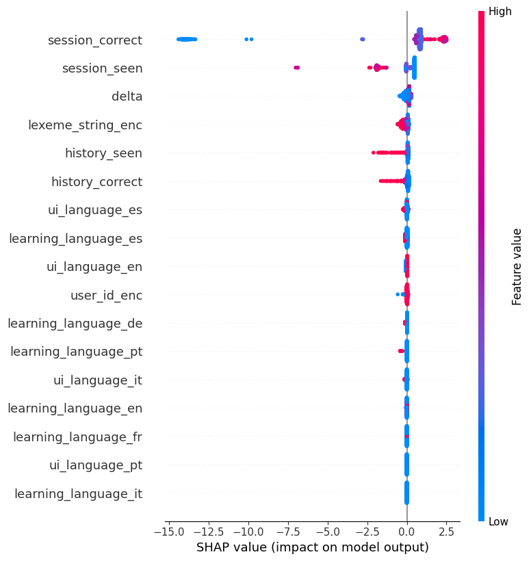
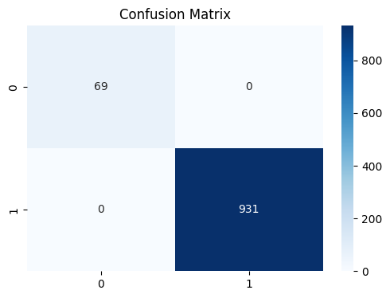
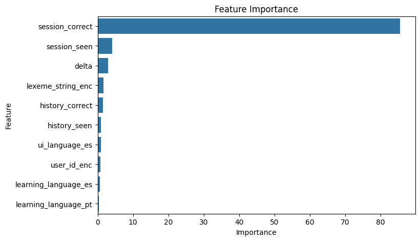
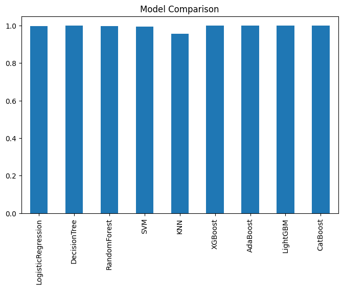

#  Explainable Recall Prediction System


---

## 📌 Overview

This project predicts whether a user will recall a learned concept using behavioral interaction data.

The focus is not just on accuracy, but on understanding how models make decisions using Explainable AI.

---

## ⚙️ Approach

* Classical ML: Random Forest, XGBoost, SVM
* Deep Learning: CNN, LSTM, CNN+LSTM
* Explainability: SHAP, LIME, PDP

---

## 📊 Results

* Accuracy up to ~97%
* Strong ROC-AUC
* Consistent feature importance

---

## 📈 Outputs

### 🔹 SHAP Plot



---

### 🔹 Confusion Matrix



---

### 🔹 Feature Importance



---

### 🔹 Model Comparison



---

## 📂 Project Structure

```id="structure_fixed"
xai-recall-prediction/
│
├── output/
│   ├── shap_plots/
│   ├── confusion_matrix/
│   └── graphs/
│
└── README.md
```

---

## 👤 Author

**Bethi Naveen Kumar**
🔗 https://www.linkedin.com/in/naveen-kumar-23109i

---
